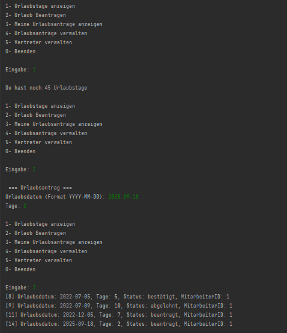
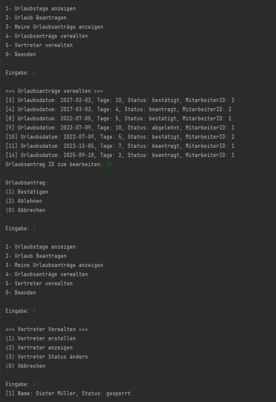

# 🏖️ MyCompanion - Urlaubsplaner

## 📋 Projektbeschreibung

Der Urlaubsplaner ist eine Java-Anwendung mit MariaDB-Datenbank, die den Urlaubsprozess in Unternehmen digitalisiert.
Es gibt zwei Rollen:

- Mitarbeiter – kann eigene Urlaubstage einsehen und Urlaubsanträge stellen.
- Chef – kann zusätzlich Urlaubsanträge aller Mitarbeiter verwalten und Vertreter für abwesende Mitarbeiter organisieren.

Das Ziel des Projekts ist es, die Urlaubsverwaltung effizienter, transparenter und einfacher zu gestalten.

## ✨ Funktionen
#### 👤 Für Mitarbeiter

- Eigene Urlaubstage einsehen
- Urlaubsanträge erstellen
- Status der gestellten Anträge überprüfen

#### 👑 Für Chefs

- Alle Urlaubsanträge im Überblick
- Anträge genehmigen oder ablehnen
- Vertreter für abwesende Mitarbeiter verwalten

## 🛠️ Technologien & Tools

- Programmiersprache: Java
- Datenbank: MariaDB
- Architektur: Client-Server mit RMI
- Entwicklungsumgebung: IntelliJ IDEA

## 📸 Screenshots (optional)

**<ins>Mitarbeiter-Interaktionen</ins>**

**<ins>Chef-Interaktionen</ins>**

## 📌 Status

Projekt abgeschlossen.